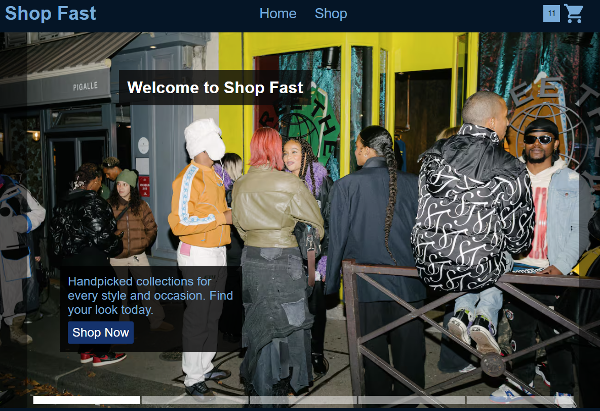
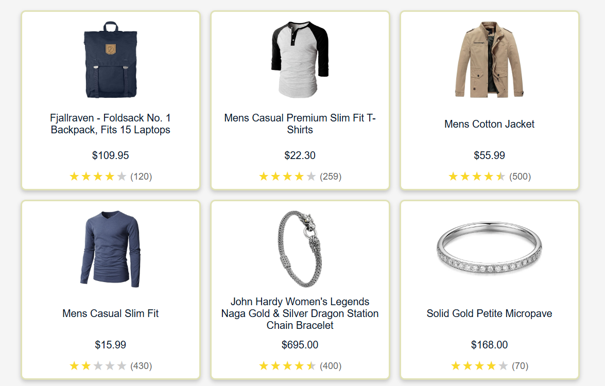
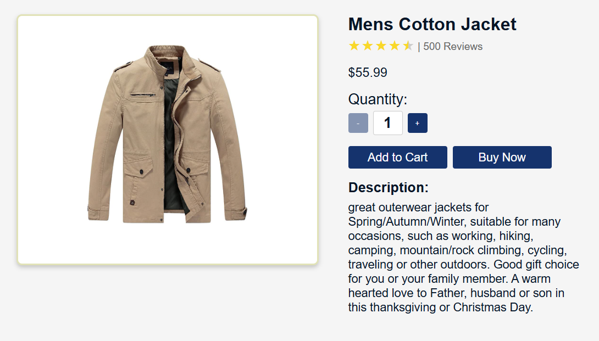
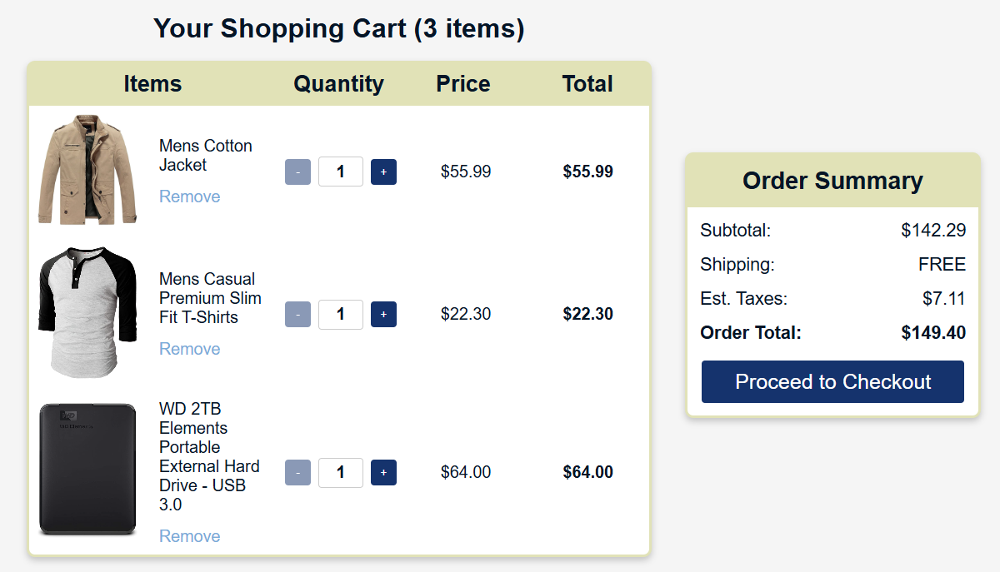

# E-Commerce Shopping Cart

A front-end e-commerce platform built as a portfolio project to demonstrate React development skills and front-end best practices.

## Live Demo

https://shopping-cart-umber-three.vercel.app/

## Features

### 🏠 Home Page

- Landing page with navigation to shop and other sections
- Responsive design for all devices

*Home Page with link to shop*

### 🛍️ Shop Page

- Browse through product catalog
- Product cards displaying:
  - product images
  - Product title
  - Price
  - Average customer rating
- Click-through to detailed product pages
- Responsive grid layout

*Shop Page with item previews*

### 📦 Product Details

- Detailed product view featuring:
  - Enlarged product images
  - Product description
  - Price
  - Customer ratings
- Quantity selection with increment/decrement controls
- Add to Cart functionality
- "Buy Now" option for direct checkout
- Continue Shopping option

*Item Page with detailed product info and purchase options*

### 🛒 Checkout Experience

- Detailed cart review
- Item management:
  - Quantity adjustments
  - Remove items (with option to undo removal)
- Order summary with:
  - Subtotal calculation
  - Estimated taxes and shipping
  - Final order total

*Checkout Page with cart summary*

## Technologies

- **React 18**
- **TypeScript**
- **React Router v6** - For seamless navigation
- **CSS Modules** - For scoped styling
- **Local Storage** - For cart persistence

## Testing
* **Vitest**
* **React Testing Library** - For testing React components
* Test coverage includes:
   * Component rendering
   * User interactions
   * Cart functionality
   * Navigation flows
   * State management
 
## Contact Information

For questions, suggestions, or feedback, please contact me at nickmufson1@gmail.com.
